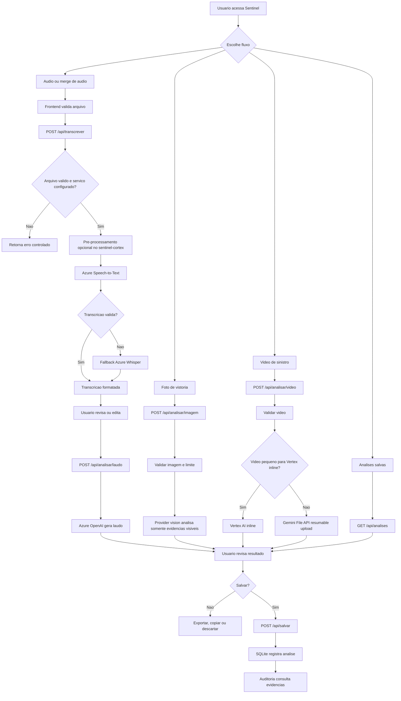
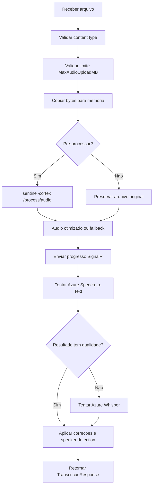
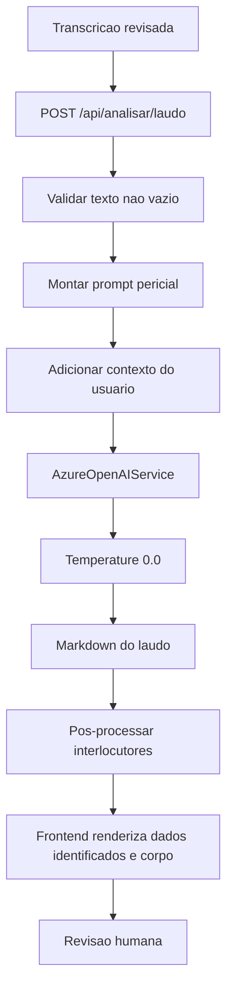
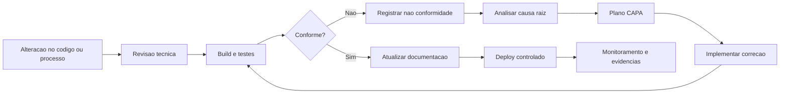
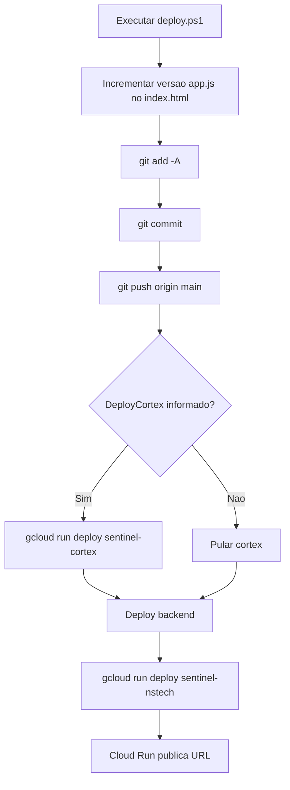

# 04 - Fluxogramas

## Fluxograma principal do processo

## Fluxo de transcricao

## Fluxo de laudo pericial

## Fluxo de controle de qualidade e melhoria

## Fluxo de deploy atual

## Fonte do fluxograma

O arquivo `assets/fluxo-principal.mmd` contem o fluxo principal em formato Mermaid para uso em ferramentas externas.

## Copia em FigJam

Fluxograma principal publicado para navegacao visual:

`https://www.figma.com/board/tgI3bEdT50AyALl519fUaz?utm_source=codex&utm_content=edit_in_figjam&oai_id=&request_id=4df7c58b-0940-44d5-89a0-f687c7f6f03e`
