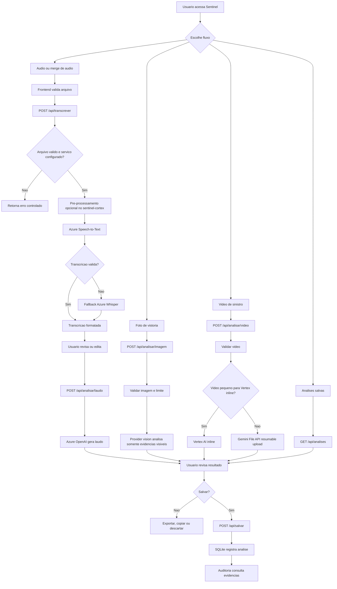
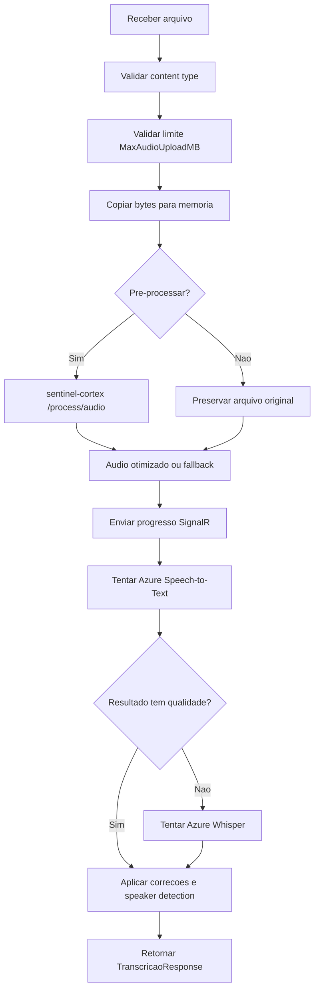
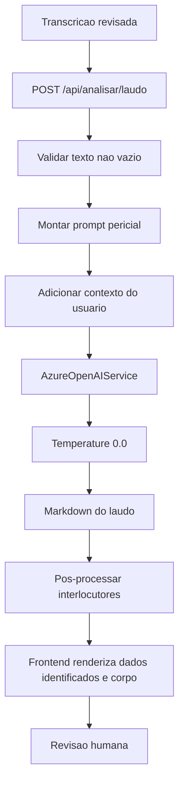
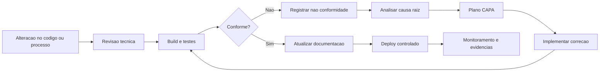
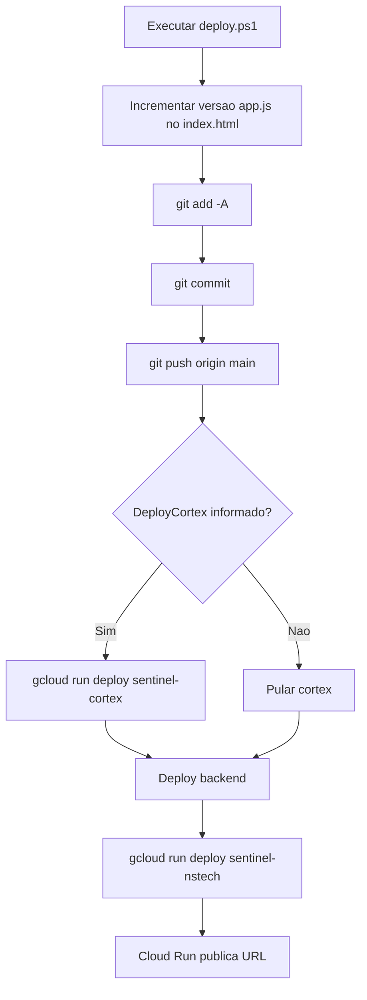

# Sentinel - Documentacao Consolidada ISO 9001

Documento consolidado gerado a partir de `docs/doc-iso`.

> Segredos e credenciais devem permanecer mascarados neste documento.


---


<!-- Fonte: 00-controle-documental.md -->


# 00 - Controle Documental

## Identificacao

| Campo | Valor |
|---|---|
| Documento | Documentacao ISO 9001 do Projeto Sentinel |
| Pasta | `docs/doc-iso` |
| Sistema | Sentinel - Analise forense de sinistros veiculares |
| Repositorio | `https://github.com/lucaslfa1/oitiva-di-refatorada` |
| Base inspecionada | Branch `main` |
| Data de elaboracao | 2026-05-18 |
| Responsavel tecnico | Equipe do projeto Sentinel |
| Status | Documento tecnico auditavel, pendente de aprovacao formal |

## Objetivo

Estabelecer uma documentacao completa do projeto Sentinel para auditoria de qualidade, com foco em:

- Processo de desenvolvimento, operacao, verificacao e melhoria.
- Evidencias rastreaveis no codigo-fonte.
- Fluxo ponta a ponta de atendimento, processamento, laudo, salvamento e monitoramento.
- Matriz de aderencia aos requisitos da ISO 9001:2015.
- Registro de riscos, nao conformidades, controles e acoes corretivas.

## Escopo

Incluido no escopo:

- Backend ASP.NET Core 8 em `Backend/`.
- Frontend estatico servido por `Backend/wwwroot/`.
- Microservico Python `sentinel-cortex/`.
- Dashboard KPI `dashboard-kpi/`.
- Banco SQLite usado pelo backend.
- Scripts de teste, deploy e verificacao presentes no repositorio.
- Documentos existentes em `docs/` usados como referencia.

Fora do escopo:

- Infraestrutura real em nuvem que nao esteja evidenciada por codigo, template ou script.
- Politicas corporativas externas da nstech/Opentech nao versionadas neste repositorio.
- Evidencias de operacao em producao nao presentes localmente, como logs de Cloud Run, registros IAM, tickets, incidentes e aprovacoes formais.

## Criterios de controle documental

| Controle | Regra |
|---|---|
| Codigo do documento | `SENTINEL-QMS-ISO9001` |
| Revisao | Deve ser incrementada a cada alteracao material. |
| Aprovacao | Requer aprovacao do responsavel tecnico e dono do processo. |
| Retencao | Manter historico no Git por tempo indeterminado ou conforme politica corporativa. |
| Publicacao | Exportar copia consolidada em DOCX/PDF quando for usada em auditoria. |
| Distribuicao | Somente por canais controlados. Nao distribuir com segredos ou credenciais. |

## Historico de revisoes

| Revisao | Data | Autor | Alteracao | Aprovacao |
|---|---:|---|---|---|
| 0.1 | 2026-05-18 | Codex | Criacao inicial baseada na inspecao do repositorio. | Pendente |

## Referencias internas

- `README.md`
- `ARQUITETURA.md`
- `docs/ARQUITETURA_FRONTEND.md`
- `docs/PLANO_AUTENTICACAO.md`
- `docs/RELATORIO_MELHORIAS.md`
- `docs/referencia-audio/README_IMPLEMENTACAO_AUDIO_AZURE.md`
- `docker-compose.yml`
- `deploy.ps1`
- `setup_gcp.ps1`

## Premissas adotadas

- A documentacao descreve o estado atual do codigo versionado, nao necessariamente o ambiente produtivo em execucao.
- Quando documentos antigos divergem do codigo atual, a evidencia primaria considerada e o codigo.
- Segredos foram mascarados nesta documentacao. A presenca de segredos no repositorio e tratada como nao conformidade.
- O termo "ISO 9001" e usado como referencia de alinhamento a requisitos de gestao da qualidade, nao como declaracao de certificacao.

## Regras para futuras alteracoes

1. Toda mudanca em endpoint, fluxo, prompt, provider de IA, autenticacao, persistencia ou deploy deve atualizar esta pasta.
2. Todo risco novo deve ser registrado em `06-riscos-controles-acoes.md`.
3. Toda evidencia de teste deve ser registrada em `07-validacao-evidencias.md`.
4. Nenhum arquivo desta pasta deve conter chave real, senha real, token ou segredo operacional.
5. Artefatos exportados em `exports/` devem ser regenerados apos mudancas relevantes.


---


<!-- Fonte: 01-manual-qualidade-iso9001.md -->


# 01 - Manual da Qualidade ISO 9001

## Politica da qualidade do projeto

O projeto Sentinel deve entregar analises forenses de sinistros veiculares com confiabilidade, rastreabilidade, controle de evidencias e linguagem tecnica. O sistema deve preservar o conteudo original recebido, aplicar processamento verificavel, reduzir alucinacoes de IA e permitir revisao humana antes do uso do laudo como evidencia operacional.

## Objetivos da qualidade

| Objetivo | Indicador sugerido | Evidencia |
|---|---|---|
| Transcrever oitivas com formato consistente | Percentual de transcricoes com timestamp e falante identificado | `TranscricaoOrquestradorService`, `AzureFastTranscricaoService`, `AzureWhisperService` |
| Gerar laudos com base em evidencias | Percentual de laudos que citam fonte ou informam "Nao mencionado" | `DescricaoAnaliseService`, `Prompts/SinistroPrompts.cs`, `Configuration/prompts.json` |
| Controlar entrada de arquivos | Rejeicao por tipo MIME e tamanho maximo | `TranscricaoController`, `AnaliseController`, `UploadLimitsOptions` |
| Manter rastreabilidade de analises | Registro salvo com tipo, conteudo, arquivo e data | `AnalisesController`, `AnaliseModel`, SQLite |
| Detectar degradacao operacional | Health checks de banco e media processor | `HealthController`, `/api/health` |
| Melhorar continuamente | Registro de riscos, falhas de teste e acoes CAPA | `06-riscos-controles-acoes.md`, `07-validacao-evidencias.md` |

## Contexto da organizacao - ISO 9001, clausula 4

O Sentinel opera em um contexto de analise de sinistros, regulacao, combate a fraudes, vistoria veicular e atendimento por oitiva. As partes interessadas incluem:

- Operadores BAS que conduzem oitivas.
- Motoristas ou declarantes que fornecem relatos.
- Analistas e peritos que revisam laudos.
- Supervisores e coordenadores que acompanham KPIs.
- Area de seguranca da informacao.
- Clientes internos/externos que auditam qualidade do processo.

### Escopo do SGQ para este projeto

O escopo recomendado do Sistema de Gestao da Qualidade aplicado ao Sentinel e:

> Projeto, desenvolvimento, operacao assistida e melhoria continua de sistema web para transcricao, analise e geracao de laudos tecnicos de sinistros veiculares, com suporte a audio, imagem, video, persistencia de analises e indicadores operacionais.

## Lideranca - ISO 9001, clausula 5

Responsabilidades recomendadas:

| Papel | Responsabilidades |
|---|---|
| Dono do processo | Definir fluxo operacional, aprovar criterios de laudo e aceitar riscos. |
| Responsavel tecnico | Manter arquitetura, codigo, testes, deploy e documentacao tecnica. |
| Qualidade/Auditoria | Revisar aderencia aos procedimentos, registrar nao conformidades e acompanhar CAPA. |
| Operacao | Executar oitivas, validar entradas e reportar falhas. |
| Seguranca | Controlar credenciais, acesso, hardening e resposta a incidentes. |

## Planejamento - ISO 9001, clausula 6

O planejamento de qualidade deve considerar riscos e oportunidades:

- Risco de alucinacao de IA: mitigado por temperatura `0.0`, prompts anti-alucinacao e exigencia de citacao.
- Risco de transcricao incorreta: mitigado por fallback Azure Speech-to-Text -> Whisper e heuristicas de falante.
- Risco de exposicao de credenciais: atualmente nao mitigado de forma suficiente, requer acao corretiva.
- Risco de indisponibilidade do microservico Python: mitigado por fallback para audio original e health check degradado.
- Risco de perda de persistencia em Cloud Run com SQLite local: requer definicao de armazenamento persistente ou banco gerenciado.
- Risco de testes quebrados: requer alinhamento de versoes de pacotes de teste e runtime.

## Suporte - ISO 9001, clausula 7

### Recursos

- Runtime .NET 8 para backend.
- Python/FastAPI para processamento de midia.
- SQLite para persistencia local.
- Azure Speech, Azure OpenAI, Azure Text Analytics, Gemini API e Vertex AI como integracoes configuraveis.
- Docker/Cloud Run para implantacao.

### Competencia

Perfis envolvidos devem dominar:

- ASP.NET Core, Entity Framework, SignalR e HTTP multipart.
- Processamento de midia com Python, pydub, ffmpeg e OpenCV.
- Operacao de providers de IA e limites de uso.
- Boas praticas de seguranca para segredos e autenticacao.
- Procedimentos de auditoria, evidencias e CAPA.

### Informacao documentada

Documentos requeridos:

- Manual da qualidade do projeto.
- Procedimentos operacionais.
- Fluxogramas.
- Matriz de rastreabilidade ISO.
- Registro de riscos e acoes.
- Evidencias de validacao.
- Registro de alteracoes e aprovacoes.

## Operacao - ISO 9001, clausula 8

O processo operacional principal e:

1. Usuario acessa frontend.
2. Usuario seleciona tipo de fluxo: audio, merge de audio, foto, video ou salvos.
3. Frontend valida presenca de arquivo e envia para endpoint correto.
4. Backend valida tipo, tamanho e configuracao do servico.
5. Backend orquestra processamento de IA e/ou media processor.
6. Resultado e exibido como transcricao ou laudo em Markdown.
7. Usuario pode editar, copiar, exportar e salvar.
8. Backend persiste analise no SQLite.
9. Dashboard e health checks apoiam monitoramento.

## Avaliacao de desempenho - ISO 9001, clausula 9

Indicadores recomendados:

- Taxa de sucesso de transcricao.
- Tempo medio de transcricao por tamanho de arquivo.
- Taxa de fallback para Whisper.
- Taxa de laudos gerados com erro.
- Taxa de arquivos rejeitados por tipo/tamanho.
- Disponibilidade de `/api/health`.
- Resultado de testes automatizados por commit.
- Quantidade de nao conformidades abertas e encerradas.

## Melhoria - ISO 9001, clausula 10

Melhorias prioritarias identificadas:

1. Remover credenciais reais do repositorio e rotacionar chaves.
2. Implementar hash de senha e autorizacao por role no backend.
3. Corrigir incompatibilidade dos testes C#.
4. Corrigir risco funcional em `sentinel-cortex/services/audio_processor.py`.
5. Consolidar decisao arquitetural de infraestrutura: Cloud Run, Azure Web App, banco persistente e providers de IA.
6. Formalizar revisao humana de laudos antes de uso externo.
7. Criar trilha de auditoria para login, transcricao, laudo, edicao, exclusao e exportacao.


---


<!-- Fonte: 02-arquitetura-e-inventario.md -->


# 02 - Arquitetura e Inventario Tecnico

## Visao geral

O Sentinel e composto por quatro blocos principais:

```text
Usuario
  -> Frontend estatico em Backend/wwwroot
  -> Backend ASP.NET Core 8
  -> Servicos de IA e media processor
  -> SQLite / arquivos / dashboard
```

## Componentes

| Componente | Caminho | Tecnologia | Responsabilidade |
|---|---|---|---|
| Backend API | `Backend/` | ASP.NET Core 8 | API REST, CORS, DI, controllers, banco, SignalR, orquestracao. |
| Frontend | `Backend/wwwroot/` | HTML/CSS/JS modular | Upload, navegacao, chamada de API, exibicao, edicao, exportacao. |
| Media Processor | `sentinel-cortex/` | Python FastAPI | Normalizacao/conversao de audio, merge, keyframes, sentimento acustico. |
| Dashboard KPI | `dashboard-kpi/` | Dash/Flask/Pandas | Indicadores de envio, ranking de operadores e filtros. |
| Persistencia | `Backend/Data/AppDbContext.cs` | EF Core + SQLite | Analises salvas e usuarios. |
| Deploy | `Dockerfile`, `Backend/Dockerfile`, `sentinel-cortex/Dockerfile`, `docker-compose.yml` | Docker/Cloud Run | Execucao e publicacao dos servicos. |

## Backend ASP.NET Core

### Inicializacao

Arquivo: `Backend/Program.cs`

Responsabilidades:

- Carrega `appsettings.Local.json` opcional.
- Carrega `Configuration/prompts.json` e `Configuration/text_corrections.json`.
- Configura limite de request e multipart.
- Registra services de IA, media processor, banco, SignalR, controllers e Swagger.
- Inicializa SQLite por `EnsureCreated`.
- Cria usuarios seed se necessario.
- Mapeia `/health`, controllers e hub `/hubs/analysis`.

### Controllers

| Controller | Rotas principais | Processo |
|---|---|---|
| `TranscricaoController` | `POST /api/transcrever`, `POST /api/analisar/laudo`, `POST /api/analisar/oitiva`, `POST /api/auditar`, `POST /api/extrair-dados` | Transcricao, laudo, auditoria de conformidade e extracao. |
| `AnaliseController` | `POST /api/analisar/imagem`, `POST /api/analisar/video` | Analise de foto e video. |
| `AnalisesController` | `POST /api/salvar`, `GET /api/analises`, `GET/DELETE /api/analises/{id}` | Persistencia e consulta de analises. |
| `AuthController` | `POST /api/auth/login`, `POST /api/auth/register` | Login e registro simples. |
| `HealthController` | `GET /api/health`, `/api/health/live`, `/api/health/ready` | Health, liveness, readiness. |
| `ToolsController` | `POST /api/tools/merge-audio` | Merge de multiplos audios. |
| `FileStorageController` | `POST /api/storage/upload` | Upload local para `wwwroot/uploads/audio`. |

## Servicos de IA e midia

| Servico | Caminho | Papel |
|---|---|---|
| `TranscricaoOrquestradorService` | `Backend/Services/TranscricaoOrquestradorService.cs` | Orquestra Azure Speech-to-Text e fallback Whisper; envia progresso por SignalR. |
| `AzureFastTranscricaoService` | `Backend/Services/AzureFastTranscricaoService.cs` | Fast Transcription API com diarizacao e phrase list. |
| `AzureWhisperService` | `Backend/Services/AzureWhisperService.cs` | Fallback Whisper via Azure OpenAI, com timestamps e filtros anti-ruido. |
| `SpeakerDetectionService` | `Backend/Services/SpeakerDetectionService.cs` | Heuristicas para Operador BAS vs Motorista e limpeza de segmentos. |
| `DescricaoAnaliseService` | `Backend/Services/DescricaoAnaliseService.cs` | Gera laudos, auditorias e comparacoes usando Azure OpenAI. |
| `AzureOpenAIService` | `Backend/Services/AzureOpenAIService.cs` | Wrapper de chat completions e visao no Azure OpenAI. |
| `ImagemAnaliseService` | `Backend/Services/ImagemAnaliseService.cs` | Analise de vistoria por imagem. |
| `VideoAnaliseService` | `Backend/Services/VideoAnaliseService.cs` | Upload e analise de video via Gemini File API ou Vertex AI. |
| `MediaProcessorService` | `Backend/Services/MediaProcessorService.cs` | Cliente HTTP para `sentinel-cortex`. |
| `AzureTextAnalyticsService` | `Backend/Services/AzureTextAnalyticsService.cs` | Analise textual de sentimento como complemento. |

## Frontend

Entrada principal: `Backend/wwwroot/index.html` carrega `js/app.js`.

Arquitetura JS:

- `js/api/sinistroApi.js`: chamadas HTTP.
- `js/core`: estado, drafts, renderizacao, tema, storage, utilitarios.
- `js/ui`: upload, modal, navegacao, toast, player, waveform.
- `js/services/analise`: transcricao, laudo, foto/video e edicao inline.
- `js/features`: salvos e merge de audio.

Fluxos principais:

- Audio: arquivo -> `/api/transcrever` -> transcricao -> `/api/analisar/laudo` -> laudo.
- Foto: arquivo -> `/api/analisar/imagem` -> laudo de vistoria.
- Video: arquivo -> `/api/analisar/video` -> laudo de video.
- Merge: multiplos arquivos -> `/api/tools/merge-audio` -> arquivo mergeado -> transcricao.
- Salvos: CRUD via `/api/salvar` e `/api/analises`.

## Banco de dados

Arquivo: `Backend/Data/AppDbContext.cs`

Tabelas:

| Tabela | Campos principais | Observacao |
|---|---|---|
| `Analises` | `Id`, `Tipo`, `Conteudo`, `Arquivo`, `Data` | Persistencia de laudos/transcricoes. |
| `Users` | `Id`, `Username`, `Password`, `Role` | Implementacao atual usa senha em texto claro. |

Configuracao:

- `DB_PATH` por variavel de ambiente.
- Fallback: `sinistros.db`.
- `EnsureCreated()` no startup.

## Sentinel Cortex

Arquivo de entrada: `sentinel-cortex/main.py`.

Rotas principais:

| Rota | Finalidade |
|---|---|
| `/health` e `/api/v1/health` | Health check. |
| `/process/audio` | Normalizacao/conversao de audio. |
| `/process/merge-audio` | Junta multiplos audios e retorna MP3. |
| `/process/video` | Extrai keyframes. |
| `/extract/audio` | Extrai audio de video. |
| `/tools/convert-to-wav` | Conversao manual para WAV. |
| `/analyze/sentiment` | Analise acustica de sentimento. |
| `/cache/stats`, `/cache/clear`, `/cache/cleanup` | Cache em memoria. |

## Dashboard KPI

Arquivo: `dashboard-kpi/app_dashboard.py`.

Responsabilidades:

- Carregar dados Excel/CSV de BI.
- Validar login consultando `BACKEND_AUTH_URL`.
- Restringir acesso por roles: `Admin`, `Coordenador`, `Supervisor`, `Analista`.
- Exibir KPIs, graficos por escala, motivos, timeline e ranking de operadores.

## Infraestrutura e deploy

| Artefato | Finalidade |
|---|---|
| `docker-compose.yml` | Sobe backend, sentinel-cortex e dashboard. |
| `Dockerfile` | Build multi-stage do backend a partir da raiz. |
| `Backend/Dockerfile` | Dockerfile especifico do backend. |
| `sentinel-cortex/Dockerfile` | Python 3.11 slim + ffmpeg + requirements. |
| `deploy.ps1` | Bump de versao do frontend, commit/push e deploy Cloud Run. |
| `setup_gcp.ps1` | Script de infraestrutura GCP planejada: Run, Storage, Firestore, Tasks, Eventarc. |

## Divergencias documentais identificadas

As referencias existentes citam combinacoes diferentes de infraestrutura e provider:

- `README.md`: Cloud Run, Gemini, SQLite.
- `ARQUITETURA.md`: Azure Web App, Azure OpenAI GPT-4, Gemini.
- Codigo atual: Azure Speech, Azure OpenAI, Azure Text Analytics, Gemini/Vertex opcionais, Cloud Run em scripts.

Para auditoria, considerar o codigo como fonte primaria e registrar decisao formal de arquitetura alvo.


---


<!-- Fonte: 03-processos-fluxos.md -->


# 03 - Processos e Fluxos Operacionais

## Macroprocesso Sentinel

| Etapa | Entrada | Atividade | Saida | Evidencia |
|---|---|---|---|---|
| 1. Acesso | Usuario e navegador | Abrir frontend servido pelo backend | Tela Sentinel | `Backend/wwwroot/index.html`, `js/app.js` |
| 2. Selecao de fluxo | Audio, foto, video, salvos ou merge | Usuario seleciona modo | Estado de UI atualizado | `ui/navigation.js`, `core/state.js` |
| 3. Upload | Arquivo e contexto | Validar selecao e enviar ao endpoint | Request multipart/form-data | `ui/upload.js`, `api/sinistroApi.js` |
| 4. Validacao backend | Request | Validar tipo, tamanho e configuracao | Rejeicao ou processamento | Controllers e `UploadLimitsOptions` |
| 5. Processamento | Bytes e contexto | IA, media processor, heuristicas e prompts | Transcricao ou laudo | Services em `Backend/Services` |
| 6. Revisao | Markdown/transcricao | Exibir, editar, copiar, exportar | Conteudo revisado | `services/analise`, `services/export.js` |
| 7. Persistencia | Conteudo final | Salvar em SQLite | Registro em `Analises` | `AnalisesController`, `AppDbContext` |
| 8. Monitoramento | Health e dashboard | Verificar status e KPIs | Indicadores e alertas | `HealthController`, `dashboard-kpi` |

## Procedimento - Transcricao de oitiva

1. Usuario seleciona arquivo de audio ou video curto na aba de audio.
2. Frontend chama `gerarTranscricao()`.
3. Frontend inicializa SignalR e obtem `connectionId`.
4. Frontend envia `POST /api/transcrever` com `Arquivo` e header `X-Connection-Id`.
5. Backend valida:
   - arquivo existente;
   - content type `audio/*`, `video/webm` ou `video/mp4`;
   - tamanho abaixo de `MaxAudioUploadMB`;
   - servico de transcricao configurado.
6. Backend pode pre-processar audio no `sentinel-cortex` quando aplicavel.
7. Orquestrador tenta Azure Speech-to-Text.
8. Se a transcricao vier fraca ou falhar, tenta Azure Whisper.
9. Backend retorna `TranscricaoResponse(transcricao, "azure")`.
10. Frontend renderiza transcricao, salva draft local e habilita edicao/exportacao.
11. Em background, backend tenta analise de sentimento por Azure Text Analytics e fallback acustico Python.

### Controles de qualidade

- Validacao de tipo e tamanho antes de processar.
- Heuristica `TranscricaoPareceValida` contra respostas vazias ou repetitivas.
- Correcao de termos por regex em `text_corrections.json`.
- Speaker detection para padronizar `Operador BAS` e `Motorista`.
- Progresso por SignalR para transparência de execucao.

## Procedimento - Geracao de laudo a partir de transcricao

1. Usuario gera ou edita transcricao.
2. Frontend chama `gerarLaudoTecnicoAPI`.
3. Backend recebe `POST /api/analisar/laudo` com `Transcricao`, `Duracao` e `Contexto`.
4. Backend valida transcricao nao vazia e provider configurado.
5. `DescricaoAnaliseService` monta prompt pericial.
6. `AzureOpenAIService` chama deployment configurado com `temperature = 0.0`.
7. Backend retorna Markdown do laudo.
8. Frontend separa tabela `DADOS IDENTIFICADOS` quando o separador existe.
9. Usuario revisa, edita, exporta e salva.

### Controles de qualidade

- Prompt obriga citacao de trecho fonte ou "Nao mencionado".
- Temperatura zero para reduzir variacao.
- Pos-processamento padroniza nomenclatura de interlocutores.
- Separacao de dados identificados facilita revisao.

## Procedimento - Analise de imagem

1. Usuario seleciona imagem e contexto.
2. Frontend envia `POST /api/analisar/imagem`.
3. Backend valida arquivo e `ContentType` iniciando com `image/`.
4. Backend valida limite `MaxImageUploadMB`.
5. `ImagemAnaliseService` seleciona provider:
   - Azure OpenAI Vision, se configurado;
   - Vertex AI, se configurado;
   - Gemini API, se houver chave.
6. Prompt orienta laudo de vistoria apenas com o que e visivel.
7. Frontend renderiza Markdown e habilita acoes.

## Procedimento - Analise de video

1. Usuario seleciona video e contexto.
2. Frontend calcula duracao quando possivel.
3. Frontend envia `POST /api/analisar/video`.
4. Backend valida arquivo e `ContentType` `video/*`.
5. `VideoAnaliseService` escolhe:
   - Vertex inline para videos pequenos;
   - Gemini File API para arquivos maiores quando configurada.
6. Gemini File API usa upload resumable, aguarda estado `ACTIVE` e analisa via `file_uri`.
7. Resultado e devolvido como laudo tecnico de video.

## Procedimento - Merge de audio

1. Usuario seleciona dois ou mais arquivos de audio/MPEG.
2. Frontend envia `POST /api/tools/merge-audio` com campo `files`.
3. Backend valida quantidade minima.
4. Backend encaminha bytes para `MediaProcessorService.MergeAudiosAsync`.
5. `sentinel-cortex` concatena segmentos, normaliza parametros e retorna MP3.
6. Frontend cria um `File` local `audio_completo_merged.mp3` e define como audio atual.
7. Usuario executa transcricao normal sobre o audio mergeado.

## Procedimento - Salvamento e consulta de analises

1. Usuario clica salvar em transcricao, laudo, foto ou video.
2. Frontend monta objeto com `tipo`, `conteudo`, `arquivo`, `dataAnalise`.
3. Frontend chama `POST /api/salvar`.
4. Backend sobrescreve `Data` com `DateTime.Now`.
5. Entity Framework salva em SQLite.
6. Usuario pode consultar ate 50 ultimas analises por `GET /api/analises`.
7. Usuario pode buscar ou excluir por ID.

## Procedimento - Autenticacao

### Estado atual

O backend possui login simples em `AuthController`:

- Busca usuario por `Username` e `Password`.
- Retorna sucesso, username e role.
- Registro cria usuario com role `Membro`.
- Nao ha JWT, hash de senha, middleware de autorizacao ou protecao de endpoints principais.

### Estado recomendado

Usar `docs/PLANO_AUTENTICACAO.md` como base para:

- JWT ou cookie seguro.
- Hash de senha com algoritmo apropriado.
- Role-based access control.
- Audit log de login e acoes sensiveis.
- Rate limiting para login.

## Procedimento - Monitoramento

| Monitor | Como validar | Criterio |
|---|---|---|
| Liveness | `GET /api/health/live` | Deve retornar `alive`. |
| Readiness | `GET /api/health/ready` | Deve retornar `ready` se DB conecta. |
| Health completo | `GET /api/health` | `healthy`, `degraded` ou `unhealthy`. |
| Media processor | Health interno via backend | Se indisponivel, status degradado quando habilitado. |
| Dashboard | Login e carregamento de graficos | Deve restringir por role permitida. |

## Registros obrigatorios por execucao critica

- Nome do arquivo processado.
- Tipo de midia.
- Data/hora.
- Provider usado.
- Resultado ou erro.
- Usuario responsavel.
- Versao do sistema.
- Evidencia da revisao humana.

Atualmente nem todos esses registros existem no banco. A lacuna deve ser tratada por um `AuditLog`.


---


<!-- Fonte: 04-fluxogramas.md -->


# 04 - Fluxogramas

## Fluxograma principal do processo



## Fluxo de transcricao



## Fluxo de laudo pericial



## Fluxo de controle de qualidade e melhoria



## Fluxo de deploy atual



## Fonte do fluxograma

O arquivo `assets/fluxo-principal.mmd` contem o fluxo principal em formato Mermaid para uso em ferramentas externas.

## Copia em FigJam

Fluxograma principal publicado para navegacao visual:

`https://www.figma.com/board/tgI3bEdT50AyALl519fUaz?utm_source=codex&utm_content=edit_in_figjam&oai_id=&request_id=4df7c58b-0940-44d5-89a0-f687c7f6f03e`


---


<!-- Fonte: 05-matriz-rastreabilidade-iso9001.md -->


# 05 - Matriz de Rastreabilidade ISO 9001

Esta matriz relaciona requisitos da ISO 9001:2015 com controles, evidencias e lacunas encontradas no projeto Sentinel.

## Matriz por clausula

| Clausula | Tema | Controle ou pratica no Sentinel | Evidencia no repositorio | Status |
|---|---|---|---|---|
| 4.1 | Contexto da organizacao | Sistema definido para sinistros, oitivas, vistorias, videos e combate a fraudes. | `README.md`, `ARQUITETURA.md`, `Configuration/prompts.json` | Parcial |
| 4.2 | Partes interessadas | Operador, motorista, analista, supervisor, admin, cliente e auditor identificados. | `docs/PLANO_AUTENTICACAO.md`, `dashboard-kpi/app_dashboard.py` | Parcial |
| 4.3 | Escopo do SGQ | Escopo proposto nesta documentacao. | `docs/doc-iso/01-manual-qualidade-iso9001.md` | Criado |
| 4.4 | Processos do SGQ | Fluxos de transcricao, laudo, midia, merge e salvamento mapeados. | `03-processos-fluxos.md`, `04-fluxogramas.md` | Criado |
| 5.1 | Lideranca | Responsabilidades propostas, mas sem aprovacao formal versionada. | `01-manual-qualidade-iso9001.md` | Lacuna |
| 5.2 | Politica da qualidade | Politica de qualidade proposta. | `01-manual-qualidade-iso9001.md` | Criado |
| 5.3 | Papeis e responsabilidades | RACI recomendado. | `09-checklists-auditoria.md` | Parcial |
| 6.1 | Riscos e oportunidades | Registro de riscos e acoes CAPA. | `06-riscos-controles-acoes.md` | Criado |
| 6.2 | Objetivos da qualidade | Indicadores recomendados. | `01-manual-qualidade-iso9001.md` | Criado |
| 6.3 | Planejamento de mudancas | Existe deploy script, mas sem procedimento formal de change control. | `deploy.ps1`, `06-riscos-controles-acoes.md` | Parcial |
| 7.1 | Recursos | Runtimes, servicos de IA, Docker e banco documentados. | `02-arquitetura-e-inventario.md` | Parcial |
| 7.2 | Competencia | Competencias recomendadas descritas, sem matriz de treinamento. | `01-manual-qualidade-iso9001.md` | Lacuna |
| 7.3 | Conscientizacao | Nao ha evidencia de treinamento formal. | Nao identificado | Lacuna |
| 7.4 | Comunicacao | SignalR comunica progresso; logs registram eventos. | `AnalysisHub`, `signalrService.js`, controllers | Parcial |
| 7.5 | Informacao documentada | Esta pasta estabelece controle documental. | `00-controle-documental.md` | Criado |
| 8.1 | Planejamento operacional | Processos descritos e endpoints implementados. | Controllers, services, `03-processos-fluxos.md` | Parcial |
| 8.2 | Requisitos para produtos e servicos | Requisitos de entrada: arquivos, contexto, tamanho, formato. | DTOs e controllers | Parcial |
| 8.3 | Projeto e desenvolvimento | Arquitetura, prompts, testes e modularizacao existem; falta registro formal de revisao/aprovacao. | `ARQUITETURA.md`, `docs/*`, testes | Parcial |
| 8.4 | Controle de provedores externos | Providers Azure/Gemini/Vertex identificados; falta SLA, avaliacao e aprovacao de fornecedores. | `appsettings.json`, services | Lacuna |
| 8.5 | Producao e provisao de servico | Fluxos de execucao e salvamento implementados. | Frontend, controllers, services | Parcial |
| 8.6 | Liberacao de produtos e servicos | Nao ha gate formal de release; `deploy.ps1` faz commit/push/deploy. | `deploy.ps1` | Lacuna |
| 8.7 | Saidas nao conformes | Erros retornam `ErrorResponse`/`Problem`; falta processo formal para laudos rejeitados. | Controllers, `06-riscos-controles-acoes.md` | Parcial |
| 9.1 | Monitoramento e medicao | Health check e dashboard KPI existem. | `HealthController`, `dashboard-kpi` | Parcial |
| 9.2 | Auditoria interna | Checklist criado; falta rotina executada e registros assinados. | `09-checklists-auditoria.md` | Criado |
| 9.3 | Analise critica pela direcao | Nao ha evidencia formal no repo. | Nao identificado | Lacuna |
| 10.1 | Melhoria | Relatorio de melhorias e riscos documentados. | `docs/RELATORIO_MELHORIAS.md`, `06-riscos-controles-acoes.md` | Parcial |
| 10.2 | Nao conformidade e acao corretiva | Registro CAPA criado nesta pasta. | `06-riscos-controles-acoes.md` | Criado |
| 10.3 | Melhoria continua | Backlog de melhorias priorizadas. | `06-riscos-controles-acoes.md` | Parcial |

## Rastreabilidade de requisitos funcionais

| Requisito | Implementacao | Evidencia | Criterio de aceite |
|---|---|---|---|
| Transcrever audio de oitiva | `POST /api/transcrever` | `TranscricaoController`, `TranscricaoOrquestradorService` | Retornar texto com timestamps e falantes. |
| Gerar laudo de oitiva | `POST /api/analisar/laudo` | `DescricaoAnaliseService`, `AzureOpenAIService` | Retornar Markdown com dados identificados e laudo. |
| Auditar conformidade | `POST /api/auditar` | `AuditarConformidade` | Relatorio de nao conformidades e score. |
| Analisar imagem | `POST /api/analisar/imagem` | `ImagemAnaliseService` | Laudo descreve apenas elementos visiveis. |
| Analisar video | `POST /api/analisar/video` | `VideoAnaliseService` | Laudo com dados tecnicos, observacoes e parecer. |
| Mesclar audios | `POST /api/tools/merge-audio` | `ToolsController`, `MediaProcessorService`, `audio_processor.py` | Retornar MP3 combinado. |
| Salvar analise | `POST /api/salvar` | `AnalisesController`, `AnaliseModel` | Registro persistido com ID. |
| Listar salvos | `GET /api/analises` | `AnalisesController` | Retornar ultimos 50 registros. |
| Health check | `GET /api/health` | `HealthController` | Informar DB e media processor. |
| Dashboard KPI | App Dash | `dashboard-kpi/app_dashboard.py` | Exibir KPIs apos login autorizado. |

## Rastreabilidade de controles tecnicos

| Controle | Codigo | Como auditar |
|---|---|---|
| Limite de tamanho de request | `Program.cs`, `UploadLimitsOptions.cs` | Conferir `MaxRequestBodySize` e `MultipartBodyLengthLimit`. |
| Validacao MIME | `TranscricaoController`, `AnaliseController` | Enviar arquivos invalidos e confirmar `400`. |
| Fallback de transcricao | `TranscricaoOrquestradorService` | Simular falha/baixa qualidade do STT e verificar Whisper. |
| Prompt anti-alucinacao | `DescricaoAnaliseService`, `prompts.json` | Revisar temperatura, instrucoes e saida esperada. |
| Health de DB | `HealthController` | Derrubar DB/caminho e verificar `503`. |
| Fallback local de salvamento no frontend | `services/salvar.js` | Simular API indisponivel e verificar localStorage. |
| Cache do Cortex | `cache_service.py` | Consultar `/cache/stats` e executar limpeza. |

## Lacunas de evidencia documental

| Lacuna | Impacto | Acao recomendada |
|---|---|---|
| Aprovacao formal do manual | Auditor pode nao aceitar documento sem dono/aprovacao. | Criar registro de aprovacao e responsaveis. |
| Change control | Deploy direto por script pode nao demonstrar segregacao. | Criar procedimento de release, aprovacao e rollback. |
| Registros de treinamento | ISO exige competencia/conscientizacao. | Criar matriz de treinamento por papel. |
| Audit log | Dificulta rastrear quem gerou/editou/excluiu laudos. | Implementar tabela `AuditLog` e middleware. |
| Controle de fornecedores de IA | Falta avaliacao de dependencia externa. | Registrar fornecedores, regioes, SLA, riscos e planos de contingencia. |


---


<!-- Fonte: 06-riscos-controles-acoes.md -->


# 06 - Riscos, Controles e Acoes Corretivas

## Criterio de classificacao

| Campo | Escala |
|---|---|
| Probabilidade | Baixa, Media, Alta |
| Impacto | Baixo, Medio, Alto, Critico |
| Prioridade | P1 critica, P2 alta, P3 media, P4 baixa |

## Registro de riscos e nao conformidades

| ID | Risco ou nao conformidade | Evidencia | Prob. | Impacto | Prioridade | Controle atual | Acao recomendada |
|---|---|---|---|---|---|---|---|
| NC-001 | Credenciais reais versionadas em configuracao. | `Backend/appsettings.json`, `dashboard-kpi/users.json`, seeds em `AppDbContext`. | Alta | Critico | P1 | Nenhum suficiente. | Remover segredos, rotacionar chaves, usar Secret Manager/env vars, reescrever historico se necessario. |
| NC-002 | Senhas em texto claro no backend. | `UserModel.Password`, `AuthController`, seeds. | Alta | Critico | P1 | Login simples. | Implementar hash, salt, politica de senha, JWT/session segura e migracao de usuarios. |
| NC-003 | Endpoints principais nao exigem autenticacao/autorizacao. | Controllers sem `[Authorize]`. | Alta | Alto | P1 | CORS parcial. | Implementar RBAC por role e middleware de autorizacao. |
| NC-004 | Testes C# falham parcialmente. | `dotnet test`: 4 aprovados, 2 falharam. | Alta | Alto | P1 | Build compila, mas teste falha. | Alinhar `Backend.Tests` para `net8.0` e EF Core 8 ou atualizar projeto inteiro com coerencia. |
| NC-005 | Variavel `start_trim` referenciada sem definicao no `audio_processor.py`. | `metadata["start_trim_seconds"] = start_trim/1000`. | Media | Alto | P2 | Py compile nao detecta. | Definir `start_trim = 0` ou remover campo se trim esta desabilitado; adicionar teste de `/process/audio`. |
| NC-006 | SQLite local pode perder dados em container sem volume persistente. | `DB_PATH=/data/sinistros.db`, docs de Cloud Run. | Media | Alto | P2 | Volume local em compose. | Usar Cloud SQL/Firestore/volume persistente; documentar backup/restore. |
| NC-007 | Divergencia entre documentacao antiga e codigo atual. | `README.md`, `ARQUITETURA.md`, docs Azure audio. | Alta | Medio | P2 | Esta documentacao registra divergencia. | Aprovar arquitetura alvo e atualizar docs antigas. |
| NC-008 | Falta audit log de acoes criticas. | Nao ha tabela `AuditLog`. | Alta | Alto | P2 | Logs de aplicacao. | Criar entidade de auditoria para login, laudo, edicao, exclusao e exportacao. |
| NC-009 | Deploy script faz `git add -A`, commit e push automaticamente. | `deploy.ps1`. | Media | Alto | P2 | Parametro `DryRun`. | Separar build/deploy de commit/push; exigir PR/aprovacao. |
| NC-010 | CORS de producao depende de lista e comentario historico fala allow any para piloto. | `Program.cs`, `appsettings.Production.template.json`. | Media | Medio | P3 | `WithOrigins` quando configurado. | Confirmar origens produtivas e bloquear wildcard. |
| NC-011 | Provider de IA externo sem registro formal de fornecedor/SLA. | Azure/Gemini/Vertex services. | Media | Alto | P3 | Health/fallback parcial. | Criar avaliacao de fornecedor, contrato, SLA, regiao e contingencia. |
| NC-012 | Saidas de IA dependem de revisao humana, mas aprovacao nao e registrada. | Frontend permite edicao/exportacao; DB salva conteudo final sem aprovador. | Media | Alto | P2 | Edicao manual. | Adicionar status, aprovador, data de revisao e historico de versoes. |
| NC-013 | Arquivos de audio em `wwwroot/uploads/audio` estao versionados. | `Backend/wwwroot/uploads/audio/*.wav`. | Media | Alto | P2 | `.gitignore` local parcial. | Remover midias sensiveis do repositorio e ajustar ignore/retencao. |
| NC-014 | Dashboard usa `server.secret_key = os.urandom(24)`, invalidando sessoes a cada restart. | `dashboard-kpi/app_dashboard.py`. | Media | Medio | P3 | Sessao Flask. | Usar segredo persistente via variavel de ambiente. |
| NC-015 | `dashboard-kpi/users.json` contem usuarios/senhas em texto claro, ainda que app atual consulte backend. | `dashboard-kpi/users.json`. | Media | Alto | P2 | Nao usado diretamente no login atual. | Remover arquivo ou trocar por template sem segredos. |

## Plano CAPA prioritario

| CAPA | Causa raiz provavel | Correcao | Prevencao | Dono sugerido | Prazo sugerido |
|---|---|---|---|---|---|
| CAPA-001 | Uso de configuracao local versionada como producao. | Remover segredos e rotacionar chaves. | Pipeline com secret scan e template seguro. | Seguranca + Dev | Imediato |
| CAPA-002 | Autenticacao criada como MVP. | Implementar hash/JWT/RBAC. | Gate de seguranca antes de release. | Dev backend | 1 sprint |
| CAPA-003 | Dependencias de teste desalinhadas. | Alinhar target framework e EF. | Renovate/dependabot e build CI obrigatorio. | Dev backend | 1 sprint |
| CAPA-004 | Codigo Python alterado com trecho comentado sem teste de endpoint. | Corrigir `start_trim`. | Teste automatizado para `/process/audio`. | Dev Python | Imediato |
| CAPA-005 | Falta trilha de auditoria de negocio. | Criar `AuditLog`. | Requisito obrigatorio para operacoes criticas. | Dev backend + Qualidade | 2 sprints |

## Controles compensatorios temporarios

Enquanto as acoes definitivas nao forem concluidas:

- Executar o sistema somente em ambiente controlado.
- Restringir rede e origens CORS.
- Usar credenciais rotacionadas e de menor privilegio.
- Manter logs de aplicacao e evidencias de execucao.
- Exigir revisao humana externa ao sistema antes de uso do laudo.
- Nao expor banco SQLite, arquivos enviados ou exports fora de canal seguro.

## Registro de aceitacao de risco

| Risco | Aceito por | Data | Justificativa | Validade |
|---|---|---|---|---|
| Pendente | Pendente | Pendente | Nenhum risco critico deve ser aceito sem aprovacao formal. | Pendente |


---


<!-- Fonte: 07-validacao-evidencias.md -->


# 07 - Validacao, Testes e Evidencias

## Ambiente usado para verificacao

| Item | Valor |
|---|---|
| Data | 2026-05-18 |
| Workspace | `D:\sentinel-open` |
| Branch | `main` |
| Commit | - |
| Sistema operacional | Windows |
| Shell usado | `cmd.exe` |

## Verificacao Git

Estado antes da criacao desta documentacao:

```text
## main...origin/main
 D fresh_cortex.txt
 D fresh_errors.txt
 D fresh_logs.txt
```

Observacao: as tres delecoes ja existiam antes desta documentacao e nao foram revertidas.

## Teste C# executado

Comando:

```powershell
dotnet test Backend\Backend.Tests\Backend.Tests.csproj
```

Resultado:

```text
Total: 6
Aprovado: 4
Falha: 2
Ignorado: 0
```

Falhas:

- `AnalisesControllerTests.Salvar_SetsDateAndReturnsId`
- `AnalisesControllerTests.Listar_LimitsTo50`

Causa tecnica observada:

```text
System.MissingMethodException:
Method not found:
Microsoft.EntityFrameworkCore.Diagnostics.AbstractionsStrings.ArgumentIsEmpty(System.Object)
```

Interpretacao:

O projeto principal usa EF Core 8 no `Backend/SinistroAPI.csproj`, enquanto `Backend.Tests` usa `TargetFramework net10.0` e `Microsoft.EntityFrameworkCore.InMemory 10.0.1`. A falha e consistente com desalinhamento de versoes entre EF Core relacional e InMemory usado nos testes.

Avisos de build observados:

- Campo `_corrections` nao anulavel em `AzureFastTranscricaoService`.
- Possivel referencia nula em `AzureTextAnalyticsService`.
- Campo `_predictionClient` nao anulavel em `VertexAIService`.

## Checagem Python executada

Primeira tentativa:

```powershell
python -m compileall sentinel-cortex -q
```

Resultado: encerrada manualmente porque varreu tambem `.venv`, escopo grande e nao necessario para evidencia do codigo versionado.

Segunda tentativa, escopo fonte:

```powershell
python -m py_compile sentinel-cortex\main.py sentinel-cortex\core\config.py sentinel-cortex\core\security.py sentinel-cortex\models\responses.py sentinel-cortex\routers\api.py sentinel-cortex\routers\v1\auth.py sentinel-cortex\routers\v1\intelligence.py sentinel-cortex\routers\v1\media.py sentinel-cortex\routers\v1\system.py sentinel-cortex\services\audio_processor.py sentinel-cortex\services\cache_service.py sentinel-cortex\services\quality_analyzer.py sentinel-cortex\services\sentiment_analyzer.py sentinel-cortex\services\video_processor.py
```

Resultado:

```text
Exit code 0
```

Interpretacao:

Os arquivos Python versionados compilam sintaticamente. Essa checagem nao cobre erros runtime, como a referencia a `start_trim` em `audio_processor.py`.

## Evidencias de validacao existentes no repositorio

| Evidencia | Caminho | Descricao |
|---|---|---|
| Testes de controller de analises | `Backend/Backend.Tests/AnalisesControllerTests.cs` | Valida salvamento e limite de 50 registros. |
| Testes de transcricao | `Backend/Backend.Tests/TranscricaoControllerTests.cs` | Valida ausencia de arquivo, MIME invalido, servico nao configurado e limite de tamanho. |
| Teste de integracao Python | `test_integration.py` | Testa transcricao e auditoria contra backend local. |
| Scripts PowerShell de teste | `test_*.ps1`, `run_audit_test.ps1` | Chamadas locais para endpoints e validacao manual. |
| Verificacao de ambiente | `verify_install.ps1` | Checa Git, Node, Python, .NET, Docker, WSL, gcloud e Azure CLI. |
| Health backend | `Backend/Controllers/HealthController.cs` | DB e media processor. |
| Health Cortex | `sentinel-cortex/routers/v1/system.py` | Status, versao e cache. |

## Criterios de aceite recomendados antes de auditoria externa

| Area | Criterio |
|---|---|
| Build | `dotnet build Backend\SinistroAPI.csproj` sem erro. |
| Testes C# | `dotnet test` 100% aprovado. |
| Python | `py_compile` e smoke test dos endpoints `/health`, `/process/audio`, `/process/merge-audio`. |
| Frontend | Smoke test de audio, foto, video, salvos e merge em navegador. |
| Seguranca | Nenhum segredo real em arquivos versionados. |
| Autenticacao | Hash de senha, RBAC e endpoints protegidos. |
| Evidencia de laudo | Laudo com transcricao, fonte, responsavel, data, revisao e status. |
| Auditoria | Audit log para acoes criticas. |
| Deploy | Release aprovado, versionado e com rollback documentado. |

## Plano de testes recomendado

### Testes unitarios

- Validacao de DTOs e limites de upload.
- Validacao de heuristicas de speaker detection.
- Validacao de parsing de Azure Speech-to-Text e Whisper.
- Validacao de prompts e separador de dados.
- Validacao de persistencia SQLite com EF Core alinhado.

### Testes de integracao

- `POST /api/transcrever` com audio curto valido.
- `POST /api/transcrever` com MIME invalido.
- `POST /api/analisar/laudo` com transcricao vazia.
- `POST /api/analisar/imagem` com arquivo nao imagem.
- `POST /api/tools/merge-audio` com um arquivo e com dois arquivos.
- `GET /api/health` com media processor habilitado/desabilitado.

### Testes de seguranca

- Autenticacao obrigatoria por endpoint.
- Tentativa de role indevida.
- Upload de arquivo grande.
- Upload com content type manipulado.
- CORS por origem nao autorizada.
- Secret scan no repositorio.

### Testes de operacao

- Deploy em ambiente homologacao.
- Health check pos-deploy.
- Geracao de laudo completo.
- Salvamento e recuperacao.
- Exportacao PDF/Word no frontend.
- Validacao do dashboard KPI.


---


<!-- Fonte: 08-snippets-codigo.md -->


# 08 - Snippets de Codigo Auditaveis

Os snippets abaixo sao curtos e mascarados quando envolvem credenciais. Eles servem como evidencia de controle, nao como substituto de revisao completa do codigo.

## Inicializacao e limites de upload

Arquivo: `Backend/Program.cs`

```csharp
var uploadLimits = builder.Configuration
    .GetSection("UploadLimits")
    .Get<UploadLimitsOptions>() ?? new UploadLimitsOptions();

builder.WebHost.ConfigureKestrel(options =>
{
    options.Limits.MaxRequestBodySize = uploadLimits.MaxRequestBodyBytes;
});

builder.Services.Configure<FormOptions>(x =>
{
    x.MultipartBodyLengthLimit = uploadLimits.MaxRequestBodyBytes;
});
```

Controle associado:

- ISO 8.1 e 8.5: controle operacional de entradas grandes.
- Evidencia de limite centralizado para upload.

## Registro de banco SQLite

Arquivo: `Backend/Program.cs`

```csharp
var dbPath = Environment.GetEnvironmentVariable("DB_PATH") ?? "sinistros.db";
builder.Services.AddDbContext<AppDbContext>(options =>
    options.UseSqlite($"Data Source={dbPath}"));
```

Controle associado:

- ISO 7.1: recurso de persistencia identificado.
- Risco: em container, requer volume persistente ou banco gerenciado.

## Health check completo

Arquivo: `Backend/Controllers/HealthController.cs`

```csharp
var dbHealthy = await _db.Database.CanConnectAsync();

if (_mediaProcessor.IsEnabled)
{
    pythonAvailable = await _mediaProcessor.IsAvailableAsync();
}

var overallStatus = dbHealthy ? "healthy" : "unhealthy";
if (dbHealthy && _mediaProcessor.IsEnabled && !pythonAvailable)
{
    overallStatus = "degraded";
}
```

Controle associado:

- ISO 9.1: monitoramento e medicao.
- Permite diferenciar falha critica de banco e degradacao do media processor.

## Validacao de audio

Arquivo: `Backend/Controllers/TranscricaoController.cs`

```csharp
if (dados.Arquivo == null || dados.Arquivo.Length == 0)
    return BadRequest(new ErrorResponse("Nenhum arquivo."));

if (!dados.Arquivo.ContentType.StartsWith("audio/") &&
    !dados.Arquivo.ContentType.StartsWith("video/webm") &&
    !dados.Arquivo.ContentType.StartsWith("video/mp4"))
    return BadRequest(new ErrorResponse("Formato invalido."));

if (dados.Arquivo.Length > _uploadLimits.MaxAudioUploadBytes)
    return StatusCode(413, new ErrorResponse("Arquivo de audio excede o limite configurado."));
```

Controle associado:

- ISO 8.2: requisitos de entrada.
- ISO 8.7: controle de saidas nao conformes por erro padronizado.

## Orquestracao de transcricao

Arquivo: `Backend/Services/TranscricaoOrquestradorService.cs`

```csharp
if (_azureSpeechToText.IsConfigured)
{
    var resultadoStt = (await _azureSpeechToText
        .TranscreverAsync(audioBytes, mimeType) ?? string.Empty).Trim();

    if (TranscricaoPareceValida(resultadoStt))
    {
        return resultadoStt;
    }
}

if (_azureWhisper.IsConfigured)
{
    return await _azureWhisper.TranscreverAsync(audioBytes, mimeType);
}
```

Controle associado:

- ISO 8.5: provisao controlada do servico.
- Reduz indisponibilidade por fallback.

## Heuristica anti-transcricao fraca

Arquivo: `Backend/Services/TranscricaoOrquestradorService.cs`

```csharp
if (linhas.Count <= 2 && transcricao.Length < 180)
{
    return false;
}

if (frases.Count >= 8 && repeticaoDominante >= 0.70)
{
    return false;
}
```

Controle associado:

- ISO 8.6: criterio tecnico para aceitar ou rejeitar resultado intermediario.
- Mitiga transcricoes vazias ou repetitivas.

## Temperatura zero no laudo

Arquivo: `Backend/Services/AzureOpenAIService.cs`

```csharp
var payload = new
{
    messages = messages,
    max_tokens = 4096,
    temperature = 0.0,
    top_p = 1
};
```

Controle associado:

- ISO 8.5 e 8.6: consistencia e repetibilidade.
- Mitiga variacao indevida em laudos periciais.

## Prompt anti-alucinacao

Arquivo: `Backend/Services/DescricaoAnaliseService.cs`

```csharp
return @"Voce e um Perito Forense da empresa Opentech.

REGRA ANTI-ALUCINACAO:
- Para CADA informacao, CITE o trecho exato da fonte
- Se nao ha trecho que comprove -> escreva ""Nao mencionado""
- NUNCA invente, deduza ou assuma dados";
```

Controle associado:

- ISO 8.2 e 8.5: requisitos do produto e controle de saida.
- Define criterio textual obrigatorio para laudos.

## Persistencia de analise

Arquivo: `Backend/Controllers/AnalisesController.cs`

```csharp
[HttpPost("salvar")]
public async Task<IActionResult> Salvar([FromBody] AnaliseModel model)
{
    model.Data = DateTime.Now;
    _db.Analises.Add(model);
    await _db.SaveChangesAsync();

    return Ok(new OperacaoResponse(model.Id, "Analise salva com sucesso!"));
}
```

Controle associado:

- ISO 7.5: informacao documentada.
- Lacuna: nao registra usuario, aprovador, versao ou historico de edicao.

## Login atual

Arquivo: `Backend/Controllers/AuthController.cs`

```csharp
var user = await _context.Users
    .FirstOrDefaultAsync(u =>
        u.Username == request.Username &&
        u.Password == request.Password);
```

Controle associado:

- Evidencia de autenticacao existente.
- Nao conformidade: senha em texto claro e ausencia de hash/token.

## Frontend chamando laudo

Arquivo: `Backend/wwwroot/js/api/sinistroApi.js`

```javascript
const response = await fetch(`${API_BASE}/analisar/laudo`, {
    method: 'POST',
    headers: { 'Content-Type': 'application/json' },
    body: JSON.stringify({
        Transcricao: transcricao,
        Duracao: duracao,
        Contexto: contexto
    })
});
```

Controle associado:

- Evidencia do contrato frontend-backend.
- Facilita teste de integracao ponta a ponta.

## Media processor client

Arquivo: `Backend/Services/MediaProcessorService.cs`

```csharp
var response = await _httpClient.PostAsync("/process/audio", content);

if (!response.IsSuccessStatusCode)
{
    _logger.LogWarning("Falha no pre-processamento de audio");
    return null;
}
```

Controle associado:

- Fallback operacional: falha do Python nao quebra transcricao.

## Sentinel Cortex - merge de audios

Arquivo: `sentinel-cortex/routers/v1/media.py`

```python
@router.post("/process/merge-audio")
async def merge_audio(files: list[UploadFile] = File(...)):
    audio_files_data = []
    for file in files:
        content = await file.read()
        audio_files_data.append((content, file.content_type or ""))

    merged, metadata = await audio_proc.merge_audios(audio_files_data)
    return Response(content=merged, media_type="audio/mpeg")
```

Controle associado:

- ISO 8.5: processo de unificacao de evidencias de audio.
- Risco: requer teste com arquivos corrompidos e limite de tamanho.

## Dashboard - controle por role

Arquivo: `dashboard-kpi/app_dashboard.py`

```python
ALLOWED_DASHBOARD_ROLES = [
    'Admin',
    'Coordenador',
    'Supervisor',
    'Analista'
]

if user_role in ALLOWED_DASHBOARD_ROLES:
    session['user'] = result.get('username')
    session['role'] = user_role
    return redirect('/')
```

Controle associado:

- ISO 7.1 e 9.1: acesso a indicadores por perfil autorizado.
- Lacuna: depende de autenticacao backend ainda simples.

## Configuracao segura recomendada

Snippet recomendado, nao copiar segredos reais:

```json
{
  "AzureOpenAI": {
    "Enabled": true,
    "ApiKey": "<AZURE_OPENAI_API_KEY>",
    "Endpoint": "https://<resource>.openai.azure.com/",
    "DeploymentName": "gpt-4o"
  }
}
```

Controle associado:

- Arquivos versionados devem conter placeholders.
- Valores reais devem vir de variaveis de ambiente ou gerenciador de segredos.


---


<!-- Fonte: 09-checklists-auditoria.md -->


# 09 - Checklists de Auditoria

## Checklist de auditoria interna ISO 9001

| Item | Pergunta | Evidencia esperada | Status |
|---|---|---|---|
| 1 | O escopo do sistema esta definido e aprovado? | `00-controle-documental.md`, assinatura/aprovacao. | Pendente |
| 2 | As partes interessadas e requisitos foram identificados? | Manual da qualidade e matriz ISO. | Parcial |
| 3 | Os processos principais possuem entradas, saidas e responsaveis? | `03-processos-fluxos.md`. | Criado |
| 4 | Existe controle de documentos e revisoes? | Historico Git e controle documental. | Parcial |
| 5 | Existem objetivos da qualidade mensuraveis? | Indicadores definidos e metricas coletadas. | Parcial |
| 6 | Riscos e oportunidades foram tratados? | `06-riscos-controles-acoes.md`. | Criado |
| 7 | As competencias por papel foram definidas? | Matriz de treinamento. | Pendente |
| 8 | A producao do servico e controlada? | Controllers, services, validações e logs. | Parcial |
| 9 | Saidas nao conformes sao identificadas e tratadas? | Erros padronizados, CAPA e registros. | Parcial |
| 10 | Testes automatizados estao passando? | `dotnet test`, Python tests, smoke tests. | Nao conforme |
| 11 | Ha auditoria interna planejada e registrada? | Checklist preenchido, evidencias e responsaveis. | Pendente |
| 12 | Existe melhoria continua e analise critica? | Backlog CAPA e atas de revisao. | Parcial |

## Checklist de seguranca

| Item | Criterio | Resultado atual | Acao |
|---|---|---|---|
| Segredos versionados | Nenhum segredo real no Git | Nao conforme | Remover e rotacionar. |
| Senhas | Hash forte, nunca texto claro | Nao conforme | Implementar hash e migracao. |
| Autorizacao | Endpoints protegidos por role | Nao conforme | `[Authorize]` e RBAC. |
| CORS | Origens produtivas explicitas | Parcial | Validar ambientes. |
| Upload | Validar MIME e tamanho | Parcial | Adicionar verificacao de extensao/conteudo. |
| Logs | Sem segredo em log | Parcial | Revisar logs de configuracao. |
| Audit log | Login e acoes sensiveis rastreados | Nao conforme | Criar tabela/eventos. |
| Retencao | Politica de arquivos enviados | Pendente | Definir e implementar limpeza. |

## Checklist de release

Antes de deploy:

- [ ] `git status` sem alteracoes inesperadas.
- [ ] Segredos ausentes do diff.
- [ ] `dotnet build Backend\SinistroAPI.csproj` sem erro.
- [ ] `dotnet test` 100% aprovado ou excecao formal aprovada.
- [ ] Teste de `sentinel-cortex` com `/health`.
- [ ] Teste de audio curto.
- [ ] Teste de laudo.
- [ ] Teste de imagem.
- [ ] Teste de video ou mock controlado.
- [ ] Teste de salvar e listar.
- [ ] Health check pos-deploy.
- [ ] Rollback conhecido.
- [ ] Documentacao atualizada.

## Checklist operacional de atendimento

| Etapa | Verificacao |
|---|---|
| Antes da oitiva | Confirmar arquivo, contexto, autorizacao e finalidade. |
| Durante processamento | Acompanhar progresso, erros e tempo. |
| Apos transcricao | Revisar falantes, timestamps e trechos inaudiveis. |
| Apos laudo | Verificar se cada afirmacao tem suporte na fonte. |
| Antes de salvar | Conferir tipo, arquivo, conteudo e revisao humana. |
| Antes de exportar | Confirmar que nao ha dados indevidos ou texto placeholder. |
| Em falha | Registrar erro, horario, arquivo, endpoint e responsavel. |

## Checklist de dados e privacidade

- [ ] Arquivos de audio/video/foto nao ficam versionados no Git.
- [ ] Dados pessoais sao tratados conforme finalidade do processo.
- [ ] Exports sao armazenados em local seguro.
- [ ] Logs nao contem credenciais ou dados sensiveis desnecessarios.
- [ ] Existe prazo de retencao de arquivos enviados e laudos.
- [ ] Exclusao de analises exige autorizacao e trilha de auditoria.

## Checklist de evidencias para auditor externo

Separar antes da auditoria:

- Copia consolidada desta documentacao em PDF/DOCX.
- Commit/tag da versao auditada.
- Resultado de testes.
- Lista de endpoints.
- Evidencia de deploy e variaveis sem segredos expostos.
- Amostra de laudo revisado e aprovado.
- Registro de usuario/role responsavel pela amostra.
- Registro de health check.
- Registro de riscos e CAPA atualizado.
- Evidencia de treinamento dos usuarios envolvidos.


---


<!-- Fonte: templates-registros.md -->


# Templates de Registros

## Registro de nao conformidade

| Campo | Preencher |
|---|---|
| ID | NC-YYYY-NNN |
| Data de abertura |  |
| Origem | Auditoria interna, cliente, incidente, teste, operacao |
| Processo afetado |  |
| Descricao |  |
| Evidencia |  |
| Impacto |  |
| Causa raiz |  |
| Correcao imediata |  |
| Acao corretiva |  |
| Acao preventiva |  |
| Responsavel |  |
| Prazo |  |
| Verificacao de eficacia |  |
| Data de encerramento |  |

## Registro de aprovacao de laudo

| Campo | Preencher |
|---|---|
| ID da analise |  |
| Tipo | Oitiva, vistoria, video, transcricao |
| Arquivo original |  |
| Data da geracao |  |
| Responsavel pela revisao |  |
| Status | Aprovado, aprovado com ressalva, reprovado |
| Ressalvas |  |
| Evidencia usada |  |
| Assinatura/aprovacao |  |

## Registro de alteracao

| Campo | Preencher |
|---|---|
| ID da mudanca | CHG-YYYY-NNN |
| Solicitante |  |
| Descricao |  |
| Motivo |  |
| Risco |  |
| Arquivos afetados |  |
| Testes executados |  |
| Plano de rollback |  |
| Aprovador |  |
| Data de implantacao |  |

